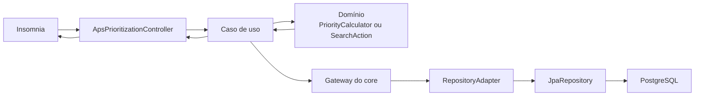

# Roteiro da apresentação técnica - SUS Conecta

Duração planejada: **aproximadamente 7 minutos**.

Limite de segurança: **encerrar até 7 minutos e 30 segundos**.

Objetivo do vídeo: apresentar brevemente o projeto e os dados analisados,
explicar o fluxo principal do código e demonstrar a solução pela collection
importada no Insomnia.

## Como usar este roteiro

- Cada bloco de fala apresenta apenas uma ideia principal.
- Não leia nomes completos de pacotes ou todos os métodos da classe.
- Mostre a classe, aponte o método importante e volte a olhar para a câmera.
- Ao explicar a arquitetura, siga sempre a mesma direção:
  **controller → caso de uso → domínio → gateway → adapter → repository**.
- Na demonstração, execute os requests de `01` a `07`. O request `90` é apenas
  um apoio para restaurar os indicadores.

## História que o vídeo deve contar

> O SUS Conecta ajuda a coordenação da Atenção Primária a identificar um
> território prioritário, entender os indicadores que justificam essa
> prioridade, registrar uma ação de busca ativa e acompanhar seu progresso de
> forma agregada.

Os dados da análise nacional são públicos, oficiais e agregados. Jardim
Esperança e os demais territórios da API são fictícios. O sistema não
prioriza pessoas e não toma decisões clínicas.

---

## Preparação antes da gravação

### 1. Conferir o serviço

Como o Docker já está ativo, confirme apenas o healthcheck:

```powershell
curl.exe http://localhost:8205/actuator/health
```

Resposta esperada:

```json
{"status":"UP"}
```

Se precisar reconstruir o serviço:

```powershell
docker compose up -d --build aps-prioritization-service
```

### 2. Preparar o Insomnia

Collection importada:

`docs/tecnico/api/aps-prioritization-insomnia.json`

No **Base Environment**, conferir:

| Variável | Uso |
| --- | --- |
| `apsServiceUrl` | Healthcheck do serviço |
| `apsBaseUrl` | Base da API: `http://localhost:8205/api/v1` |
| `apsTerritoryId` | ID estável de Jardim Esperança |
| `apsCreatedActionId` | ID da ação que será atualizada no passo 06 |
| `apsDemoStartDate` | Dia da gravação |
| `apsDemoEndDate` | Sete dias depois da gravação |
| `apsDemoCompetence` | Competência usada somente pelo request opcional 90 |

Antes do take:

1. atualizar `apsDemoStartDate` e `apsDemoEndDate`;
2. executar os requests de `01` a `07` uma vez;
3. confirmar que todos respondem;
4. voltar ao request `01`;
5. deixar o **Base Environment** fácil de abrir com `Ctrl+E`.

O Insomnia não captura automaticamente o ID criado no passo 05. Depois de criar
a ação, copie o campo `id`, abra o **Base Environment** com `Ctrl+E` e substitua
o valor de `apsCreatedActionId` antes de executar o passo 06.

### 3. Preparar as abas da IDE

Abrir nesta ordem:

1. `ApsPrioritizationController.java`;
2. `CreateSearchActionUseCase.java`;
3. `PriorityCalculator.java`;
4. `SearchAction.java`;
5. `SearchActionGateway.java`;
6. `SearchActionRepositoryAdapter.java`;
7. `SearchActionJpaRepository.java`.

Deixe também aberto:

- `analytics/reports/analise_aps_sus.html`;
- `GetDashboardUseCase.java`, apenas como apoio para perguntas;
- o Insomnia com a pasta **APS Prioritization Flow** expandida.

---

## Fluxo técnico em uma imagem



### Explicação em uma frase

> O controller recebe a chamada e delega; o caso de uso coordena o fluxo; o
> domínio aplica as regras; o gateway define o que precisa ser persistido; o
> adapter traduz domínio e JPA; e o repository acessa o banco.

O ponto mais importante da arquitetura é que o controller não acessa o
repository diretamente. As regras também não ficam no controller ou nas
entidades JPA.

---

## Classes principais em ordem de fluxo

| Ordem | Classe ou grupo | Explicação simples |
| --- | --- | --- |
| 1 | `ApsPrioritizationController` | É a porta de entrada HTTP. Recebe parâmetros e payloads, valida o formato, transforma requests em comandos e chama o caso de uso correto. |
| 2 | Casos de uso | Coordenam cada operação. Buscam dados pelos gateways, chamam as regras de domínio e montam o resultado. |
| 3 | `PriorityCalculator` | Classifica o território como `HIGH`, `MEDIUM` ou `LOW` e registra os motivos da prioridade. |
| 4 | `SearchAction` | Representa a ação territorial e protege regras de criação, atualização, prazo e cálculo do progresso. |
| 5 | `TerritoryGateway` e `SearchActionGateway` | São contratos do core. Dizem quais operações de persistência a aplicação precisa, sem depender de JPA. |
| 6 | `TerritoryRepositoryAdapter` e `SearchActionRepositoryAdapter` | Implementam os gateways e convertem objetos do domínio em entidades JPA e vice-versa. |
| 7 | `TerritoryJpaRepository` e `SearchActionJpaRepository` | Usam Spring Data para executar consultas e gravações no banco. |
| 8 | `ApsExceptionHandler` | Traduz exceções conhecidas para respostas HTTP padronizadas com `ProblemDetail`. |

### Casos de uso ligados aos requests do Insomnia

| Request | Caso de uso principal | O que ele faz |
| --- | --- | --- |
| Dashboard | `GetDashboardUseCase` | Busca territórios e ações, calcula prioridades, contadores e alertas de prazo. |
| Prioridades HIGH | `ListTerritoriesUseCase` | Classifica, filtra e ordena os territórios. |
| Detalhe do território | `GetTerritoryDetailsUseCase` | Busca o território, calcula a prioridade e reúne o histórico de ações. |
| Criar ação | `CreateSearchActionUseCase` | Confirma que o território existe, cria `SearchAction` e salva pelo gateway. |
| Atualizar progresso | `UpdateSearchActionProgressUseCase` | Busca a ação, chama `updateProgress` no domínio e salva o novo estado. |

### Dois fluxos fáceis de explicar

Criação da ação:

```text
createSearchAction no controller
  → CreateSearchActionUseCase
  → TerritoryGateway.findById
  → SearchAction.create
  → SearchActionGateway.save
  → SearchActionRepositoryAdapter
  → SearchActionJpaRepository
```

Atualização do progresso:

```text
updateSearchActionProgress no controller
  → UpdateSearchActionProgressUseCase
  → SearchActionGateway.findById
  → SearchAction.updateProgress
  → SearchActionGateway.save
  → adapter e repository
```

---

## Roteiro cronometrado

### 0:00-0:40 — Explicação breve do projeto

**Na tela:** README ou nome do projeto.

**Fala:**

> Este é o SUS Conecta, uma solução para apoiar a priorização territorial de
> busca ativa na Atenção Primária. A pergunta que ele responde é: com equipes e
> tempo limitados, em qual território a coordenação deve organizar uma ação
> preventiva primeiro, e por quê?
>
> O sistema usa indicadores agregados, explica a prioridade e permite registrar
> uma ação com foco, equipe, prazo, meta e progresso. Ele não trabalha com
> prontuários ou risco clínico individual.

**[TROQUE PARA A ANÁLISE]**

---

### 0:40-1:15 — Dados e análise

**Na tela:** `analytics/reports/analise_aps_sus.html`.

**Fala:**

> A escolha do problema foi apoiada por dados públicos e agregados. Usamos a
> população municipal do IBGE de 2025, cadastros vinculados do SISAB e
> indicadores preventivos do terceiro quadrimestre de 2024.
>
> A análise encontrou vínculo nacional aproximado de 38,11%. Entre municípios
> com pelo menos 20 mil habitantes, 1.091 ficaram abaixo de 50% nessa
> aproximação e 276 tiveram média de indicadores abaixo de 40%.
>
> Esses números mostram uma oportunidade de organização territorial. Eles não
> medem qualidade clínica e não provam causalidade. A API usa uma massa
> fictícia e agregada para demonstrar a solução com segurança.

**[TROQUE PARA A IDE]**

---

### 1:15-1:50 — Controller e casos de uso

**Na tela:** `ApsPrioritizationController`, depois
`CreateSearchActionUseCase`.

**Fala:**

> O fluxo começa no `ApsPrioritizationController`. Ele expõe os endpoints,
> recebe parâmetros e payloads, converte a entrada para os comandos do core e
> chama o caso de uso correspondente.
>
> O controller não contém a regra de prioridade e não acessa o banco
> diretamente. Na criação de uma ação, ele chama
> `CreateSearchActionUseCase`. Esse caso de uso confirma que o território
> existe, cria o objeto `SearchAction` e solicita a gravação pelo
> `SearchActionGateway`.
>
> Os outros endpoints seguem o mesmo padrão, cada um com um caso de uso
> específico.

**Apontar:**

- os métodos `getDashboard`, `listTerritories` e `createSearchAction`;
- a chamada `createSearchActionUseCase.execute(...)`;
- os campos `TerritoryGateway` e `SearchActionGateway` dentro do caso de uso.

---

### 1:50-2:20 — Regras de domínio

**Na tela:** `PriorityCalculator`, depois `SearchAction`.

**Fala:**

> As regras ficam no domínio. O `PriorityCalculator` compara o vínculo e os
> indicadores com suas metas. Vínculo baixo junto com pelo menos um indicador
> abaixo da meta gera prioridade alta. Apenas um desses sinais gera prioridade
> média; quando todos atingem as metas, a prioridade é baixa.
>
> A classe `SearchAction` controla a execução da ação. Ela começa como
> `PLANNED`, calcula o percentual realizado, identifica prazos e impede, por
> exemplo, que uma ação seja concluída com zero contatos realizados.

**Apontar:**

- método `assess` em `PriorityCalculator`;
- método `updateProgress` e `progressPercent` em `SearchAction`.

---

### 2:20-2:45 — Gateway, adapter e repository

**Na tela:** `SearchActionGateway`, `SearchActionRepositoryAdapter` e
`SearchActionJpaRepository`.

**Fala:**

> Para persistir sem acoplar o core ao banco, o caso de uso depende de um
> gateway. O `SearchActionGateway` define operações como buscar e salvar.
>
> O `SearchActionRepositoryAdapter` implementa esse contrato e converte entre o
> domínio e a entidade JPA. Só no final aparece o
> `SearchActionJpaRepository`, que executa a persistência.
>
> Então a dependência segue para dentro: o domínio não conhece Spring Data nem
> PostgreSQL.

**[TROQUE PARA O INSOMNIA]**

---

### 2:45-3:00 — Request 01: serviço no ar

**Executar:** `01 - Health | servico no ar`.

**Fala:**

> Primeiro eu confirmo que a aplicação está disponível. O healthcheck responde
> HTTP 200 com status `UP`.

**Apontar:** `status = UP`.

---

### 3:00-3:25 — Request 02: dashboard inicial

**Executar:** `02 - Dashboard inicial | fila territorial`.

**Fala:**

> O dashboard resume a situação operacional. Com a massa limpa, ele mostra um
> território em alta prioridade, duas ações abertas, uma ação concluída e os
> alertas de prazo.
>
> O mais importante é que o painel já devolve uma fila de trabalho, e não apenas
> indicadores isolados.

**Apontar:**

- `highPriorityTerritoryCount`;
- `openActionCount`;
- `completedActionCount`;
- `topPriorities`;
- `attentionActions`.

---

### 3:25-3:50 — Request 03: escolher o território

**Executar:** `03 - Prioridades HIGH | escolher territorio`.

**Fala:**

> A listagem aceita filtros e vem ordenada. Ao filtrar por `HIGH`, Jardim
> Esperança aparece com foco de atenção em condições crônicas.
>
> A unidade de decisão é o território ou a UBS, nunca uma pessoa.

**Apontar:**

- `name = Jardim Esperanca`;
- `priority = HIGH`;
- `attentionFocus = CHRONIC_CONDITIONS`;
- `openActionCount`.

---

### 3:50-4:25 — Request 04: explicar a prioridade

**Executar:** `04 - Detalhe Jardim Esperanca | explicar regra`.

**Fala:**

> No detalhe aparece a explicação da prioridade. Jardim Esperança possui 42% de
> população vinculada para uma meta de 50%. Condições crônicas está em 32% para
> uma meta de 60%, e pré-natal em 72% para uma meta de 85%.
>
> Como o vínculo e indicadores preventivos estão abaixo das metas, a prioridade
> é alta. A resposta também informa a competência dos dados e os motivos
> textuais gerados pelo `PriorityCalculator`.

**Apontar:**

- `linkedPopulationPercent = 42.00`;
- `dataCompetence`;
- `priority.level = HIGH`;
- `priority.linkageTarget = 50.00`;
- `priority.reasons`;
- `indicators`.

---

### 4:25-5:15 — Request 05: criar a ação

**Na tela:** payload do request 05.

**Fala antes de executar:**

> Agora a prioridade vira uma ação territorial. O payload informa o foco
> preventivo, o objetivo, a equipe responsável, o período e uma meta agregada
> de 80 contatos. Não existe nome, CPF, prontuário ou dado clínico individual.

**Executar:** `05 - Criar acao territorial | prioridade vira trabalho`.

**Fala depois da resposta:**

> A API retorna HTTP 201. A ação nasce como `PLANNED`, com meta 80, zero
> realizado e progresso de zero por cento.
>
> Vou copiar o `id` retornado e atualizar a variável `apsCreatedActionId` no
> Base Environment. Assim, o próximo request altera exatamente a ação que eu
> acabei de criar.

**Ação na tela:**

1. copiar o valor de `id`;
2. pressionar `Ctrl+E`;
3. substituir `apsCreatedActionId`;
4. fechar o editor do ambiente.

**Apontar:**

- HTTP `201`;
- `id`;
- `status = PLANNED`;
- `targetCount = 80`;
- `performedCount = 0`;
- `progressPercent = 0.00`.

---

### 5:15-6:00 — Request 06: atualizar o progresso

**Executar:** `06 - Atualizar progresso | execucao agregada`.

**Fala:**

> Agora a equipe registra 54 contatos agregados e muda a ação para
> `IN_PROGRESS`.
>
> O `UpdateSearchActionProgressUseCase` busca a ação pelo gateway, chama
> `updateProgress` no domínio e salva o novo estado. A resposta mostra 54 de 80,
> ou 67,50% de progresso.
>
> Esse percentual mede execução operacional. Ele não informa quem foi
> contatado e não comprova melhora clínica.

**Apontar:**

- HTTP `200`;
- `status = IN_PROGRESS`;
- `performedCount = 54`;
- `progressPercent = 67.50`;
- `resultNotes`.

---

### 6:00-6:25 — Request 07: fechar o ciclo

**Executar:** `07 - Dashboard apos progresso | fechar ciclo`.

**Fala:**

> Para fechar o ciclo, eu volto ao dashboard. A nova ação permanece aberta e o
> contador aumenta. A coordenação continua vendo as prioridades e os alertas de
> prazo no mesmo lugar em que iniciou a decisão.
>
> Assim, o fluxo vai do indicador para a prioridade, da prioridade para a ação
> e da ação para o acompanhamento.

**Apontar:**

- `openActionCount`;
- `topPriorities`;
- `attentionActions`.

---

### 6:25-6:55 — Encerramento técnico

**Na tela:** collection completa do Insomnia ou diagrama do fluxo.

**Fala:**

> Tecnicamente, a entrada HTTP fica no controller, a coordenação do fluxo fica
> nos casos de uso, as regras ficam no domínio e a persistência é acessada por
> gateways e adapters.
>
> Na prática, essa separação sustenta um fluxo simples: identificar um
> território prioritário, explicar a regra, registrar uma ação e acompanhar seu
> progresso agregado. A decisão final continua com a coordenação e a equipe de
> saúde.

Finalizar a gravação. Não improvisar um segundo encerramento.

---

## Colinha rápida para perguntas técnicas

### Por que o controller não chama o repository?

> Porque o controller deve cuidar apenas da entrada e saída HTTP. A operação é
> coordenada pelo caso de uso, que depende de interfaces do core e não de uma
> tecnologia específica de banco.

### Qual a diferença entre gateway, adapter e repository?

> O gateway é o contrato definido pelo core. O adapter implementa esse contrato
> e faz o mapeamento entre domínio e persistência. O `JpaRepository` executa as
> operações no banco.

### Onde fica a regra de prioridade?

> Em `PriorityCalculator`, dentro do domínio. O caso de uso chama essa classe e
> o controller apenas devolve o resultado.

### Onde fica a regra do progresso?

> Em `SearchAction`. O método `updateProgress` valida a transição, e
> `progressPercent` calcula o percentual realizado.

### Como os erros chegam à API?

> As exceções do domínio são tratadas por `ApsExceptionHandler`, que devolve
> respostas padronizadas com `ProblemDetail`.

### Os dados da demonstração são reais?

> As bases e os resultados nacionais da análise são reais e agregados. Os
> territórios, indicadores e ações usados na API são fictícios.

---

## Request 90 e repetição da demonstração

O request `90 - Opcional | resetar indicadores Jardim Esperanca` restaura os
indicadores de Jardim Esperança, mas não apaga ações criadas.

Se a demonstração for repetida, os contadores podem aumentar. Isso não quebra o
fluxo: compare o `openActionCount` antes e depois da criação.

Para restaurar completamente a massa inicial, seria necessário recriar o banco
demonstrativo. Faça isso somente fora da gravação e apenas se os dados locais
puderem ser removidos.

---

## Checklist do take final

- Serviço respondendo `UP`.
- Datas do request 05 atualizadas.
- Base Environment fácil de abrir com `Ctrl+E`.
- Ordem dos requests: `01`, `02`, `03`, `04`, `05`, `06`, `07`.
- ID do passo 05 copiado para `apsCreatedActionId`.
- Classes abertas na ordem controller, use case, domínio e persistência.
- Código com zoom suficiente para leitura.
- Nenhuma notificação, aba pessoal ou credencial visível.
- Dados nacionais descritos como reais e agregados.
- Massa da API descrita como fictícia.
- Prioridade descrita como operacional, nunca como risco clínico.
- Progresso descrito como execução, nunca como impacto assistencial.
- Gravação encerrada antes de 7 minutos e 30 segundos.
