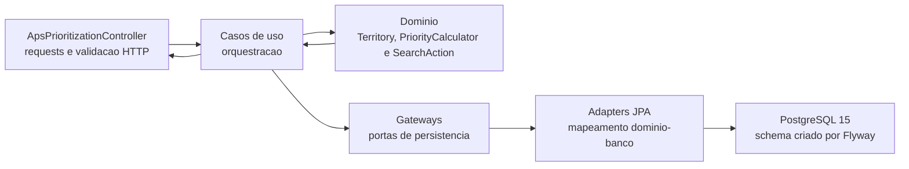

# Roteiro do video tecnico do MVP - SUS Conecta

Duracao-alvo: **7 minutos e 35 segundos**.

Objetivo: demonstrar o backend funcionando, explicar as classes centrais e
mostrar como dados agregados sustentaram a escolha do problema, sem confundir
a analise exploratoria com a massa ficticia da API.

Ferramentas de gravacao recomendadas:

- IDE para mostrar estrutura e classes;
- relatorio HTML ou Markdown da analise;
- Bruno com a collection `docs/tecnico/api/`;
- terminal apenas para healthcheck e, se desejado, evidencias de teste;
- tela em 1920 x 1080, com notificacoes, abas pessoais e barra do Windows
  ocultas.

## Mensagem que deve orientar todo o video

> O SUS Conecta recebe indicadores agregados por territorio, aplica uma regra
> operacional explicavel e ajuda a coordenacao a transformar prioridade em uma
> acao de busca ativa acompanhada de forma agregada.

Nao dizer que o sistema diagnostica, identifica pacientes, prediz agravamento,
evita internacao ou comprova impacto clinico.

## Preparacao antes de gravar

### 1. Ambiente

Subir o servico:

```powershell
docker compose up -d --build aps-prioritization-service
curl.exe http://localhost:8205/actuator/health
```

Resposta esperada:

```json
{"status":"UP"}
```

Para obter a mesma massa e os mesmos contadores descritos neste roteiro, o
banco demonstrativo deve estar limpo. O comando abaixo remove o volume local
da demonstracao; use-o somente se nao houver dados que precisem ser
preservados:

```powershell
docker compose down -v
docker compose up -d --build aps-prioritization-service
```

### 2. Bruno

1. Abrir como collection a pasta `docs/tecnico/api/`.
2. Selecionar o ambiente `aps-local`.
3. Atualizar `apsDemoStartDate` para o dia da gravacao.
4. Atualizar `apsDemoEndDate` para sete dias depois.
5. Confirmar que `apsCreatedActionId` sera preenchido automaticamente pelo
   request 05.
6. Executar a sequencia uma vez antes da gravacao.
7. Limpar novamente a massa antes do take final.

### 3. Abas e arquivos ja preparados

Abrir nesta ordem:

1. `analytics/reports/analise_aps_sus.html`;
2. arvore `core` e `infra` do servico;
3. `PriorityCalculator.java`;
4. `SearchAction.java`;
5. `ApsPrioritizationController.java`;
6. `UseCaseConfig.java`;
7. Bruno, com os requests 01 a 07 visiveis;
8. `docs/tecnico/e2e/relatorio_execucao_e2e.md`.

Nao navegar procurando arquivos durante a gravacao. Deixar cada ponto pronto
reduz silencio e risco de ultrapassar o limite.

## Mapa tecnico para explicar



As dependencias apontam para o `core`. Spring, JPA, Jakarta Validation,
ProblemDetail e Flyway permanecem em `infra`.

## Classes principais e o que dizer

| Classe ou grupo | Papel no fluxo | Ponto para mostrar |
| --- | --- | --- |
| `ApsPrioritizationController` | Traduz HTTP em comandos do core e devolve os outputs. | Endpoints `/dashboard`, `/territories`, `/actions`. |
| `PriorityCalculator` | Aplica a regra `HIGH`, `MEDIUM` ou `LOW` e gera os motivos. | Metodo `assess`. |
| `Territory` | Protege invariantes dos dados territoriais agregados. | Percentuais de 0 a 100, competencia obrigatoria e foco sem duplicidade. |
| `SearchAction` | Controla status, progresso, prazo e regra de conclusao. | `updateProgress`, `progressPercent`, `isOverdue` e `isDueSoon`. |
| Casos de uso | Orquestram leitura, classificacao, criacao e atualizacao. | `GetDashboardUseCase`, `GetTerritoryDetailsUseCase`, `CreateSearchActionUseCase` e `UpdateSearchActionProgressUseCase`. |
| Gateways e adapters | Mantem o core independente do banco. | `TerritoryGateway`/`SearchActionGateway` e adapters JPA. |
| `UseCaseConfig` | Faz a composicao das dependencias no limite de infraestrutura. | Meta de vinculo configuravel e injecao dos gateways. |
| `ApsExceptionHandler` | Converte erros conhecidos em `ProblemDetail`. | Validacao de dominio retorna HTTP `422`. |

Nao e necessario abrir todas essas classes. Para caber no tempo, mostrar a
arvore e abrir somente `PriorityCalculator`, `SearchAction` e
`ApsPrioritizationController`.

## Roteiro cronometrado

### 0:00-0:25 - Abertura tecnica

**Na tela:** titulo do projeto e estrutura raiz do repositorio.

**Fala:**

> Este e o SUS Conecta, um backend em Java 21 e Spring Boot 3.4.5 para apoiar
> a priorizacao territorial de busca ativa na Atencao Primaria. Nesta
> demonstracao eu vou mostrar de onde veio a oportunidade, como organizamos a
> arquitetura e, principalmente, o fluxo real da API: identificar um
> territorio, explicar a prioridade, criar uma acao e registrar seu progresso.

### 0:25-1:00 - Dados e analise

**Na tela:** topo de `analytics/reports/analise_aps_sus.html`, com os indicadores
principais.

**Fala:**

> A escolha do problema foi apoiada por dados publicos agregados. Usamos
> IBGE 2025 e bases agregadas do SISAB. O pipeline Python organizou as fontes
> por municipio e calculou proporcoes. Observamos vinculo aproximado nacional
> de 38,11%, 1.091 municipios com mais de 20 mil habitantes abaixo de 50% de
> vinculo e 276 com media de indicadores abaixo de 40. Esses resultados
> sustentam uma oportunidade de investigacao territorial; nao provam qualidade
> clinica nem causalidade.

**Apontar rapidamente:**

- `analytics/scripts/analisar_aps_sus.py`;
- `data/raw` como preservacao das fontes;
- `data/processed` como saidas tabulares;
- `analytics/reports` como resultado reproduzivel.

**Frase de transicao:**

> A analise escolheu a oportunidade. A demonstracao da API usa territorios
> ficticios e agregados para nao expor pessoas.

### 1:00-1:50 - Arquitetura e classes centrais

**Na tela:** arvore `core`/`infra`, seguida de `PriorityCalculator` e
`SearchAction`.

**Fala:**

> O servico segue Clean Architecture. No core ficam dominio, casos de uso,
> DTOs e interfaces de gateway, todos em Java puro. O controller, Spring, JPA,
> validacao HTTP e tratamento de erros ficam em infraestrutura.
>
> A regra principal esta em `PriorityCalculator`. Vinculo abaixo da meta e ao
> menos um indicador preventivo abaixo da propria meta resultam em prioridade
> alta. Apenas um desses sinais resulta em media; nenhum resulta em baixa. O
> retorno inclui os motivos, portanto nao e uma caixa preta.
>
> `SearchAction` concentra a regra de execucao: nasce como `PLANNED`, calcula o
> percentual realizado, identifica prazo e impede concluir uma acao com
> quantidade realizada igual a zero. Os casos de uso orquestram essas regras e
> acessam persistencia por gateways, sem acoplar o core ao PostgreSQL.

### 1:50-2:10 - Infraestrutura e qualidade

**Na tela:** `UseCaseConfig`, migration `V1` e, por poucos segundos, o resumo de
testes.

**Fala:**

> `UseCaseConfig` monta os casos de uso e injeta a meta de vinculo configuravel.
> Os adapters traduzem dominio e entidades JPA. O PostgreSQL 15 e criado por
> Flyway, enquanto o Hibernate apenas valida o schema. A suite atual possui 18
> testes sem falhas e cobertura de linhas de 98,94%.

### 2:10-2:25 - API no ar

**Na tela:** request 01 do Bruno.

**Executar:** `01 - Health | servico no ar`.

**Fala:**

> A aplicacao esta em Docker, na porta 8205. O healthcheck retorna HTTP 200 e
> status `UP`.

**Apontar:** `status = UP`.

### 2:25-2:55 - Dashboard inicial

**Executar:** `02 - Dashboard inicial | fila territorial`.

**Fala:**

> O primeiro endpoint resume a decisao operacional. Com a massa limpa, existe
> um territorio em alta prioridade, duas acoes abertas e uma concluida no
> periodo. O dashboard tambem devolve as cinco maiores prioridades e acoes
> vencidas ou proximas do prazo.

**Apontar:**

- `highPriorityTerritoryCount = 1`;
- `openActionCount = 2`;
- `completedActionCount = 1`;
- `topPriorities`;
- `attentionActions`.

### 2:55-3:20 - Escolha do territorio

**Executar:** `03 - Prioridades HIGH | escolher territorio`.

**Fala:**

> A listagem aceita filtros e ja vem ordenada. Filtrando por `HIGH`, Jardim
> Esperanca aparece como primeiro territorio, com foco de atencao em
> `CHRONIC_CONDITIONS`. A unidade de decisao e territorio ou UBS, nunca uma
> pessoa.

**Apontar:**

- `name = Jardim Esperanca`;
- `priority = HIGH`;
- `attentionFocus = CHRONIC_CONDITIONS`;
- `openActionCount`.

### 3:20-4:05 - Explicacao da prioridade

**Executar:** `04 - Detalhe Jardim Esperanca | explicar regra`.

**Fala:**

> O detalhe comprova a explicabilidade. Jardim Esperanca possui 42% de
> populacao vinculada para uma meta configurada de 50%. Condicoes cronicas
> esta em 32% para meta de 60%, e pre-natal em 72% para meta de 85%. O objeto
> `priority` devolve o nivel, a meta usada e as razoes textuais. A competencia
> dos dados tambem acompanha o territorio. O sistema apoia a coordenacao a
> investigar e organizar trabalho; ele nao classifica risco clinico.

**Apontar:**

- `linkedPopulationPercent = 42.00`;
- `dataCompetence`;
- `priority.level = HIGH`;
- `priority.linkageTarget = 50.00`;
- `priority.reasons`;
- `indicators`.

### 4:05-5:05 - Criacao de uma acao

**Na tela:** request 05, mostrando o payload antes de executar.

**Executar:** `05 - Criar acao territorial | prioridade vira trabalho`.

**Fala antes da chamada:**

> Agora a prioridade vira uma acao territorial. O payload informa foco
> preventivo, objetivo, equipe responsavel, periodo e uma meta agregada de 80
> contatos. Nao existe nome, CPF, endereco, prontuario ou diagnostico.

**Fala depois da chamada:**

> A API retorna HTTP 201. A acao nasce como `PLANNED`, com zero realizado e
> zero por cento de progresso. O ID retornado e capturado automaticamente pelo
> Bruno para atualizar exatamente esta acao no proximo passo.

**Apontar:**

- HTTP `201`;
- `id`;
- `status = PLANNED`;
- `targetCount = 80`;
- `performedCount = 0`;
- `progressPercent = 0.00`.

### 5:05-5:45 - Atualizacao do progresso

**Executar:** `06 - Atualizar progresso | execucao agregada`.

**Fala:**

> A equipe registra 54 contatos agregados e muda a situacao para
> `IN_PROGRESS`. O dominio recalcula 54 dividido por 80 e devolve 67,50%. Esse
> numero mede execucao operacional. Ele nao informa quem foi contatado e nao
> comprova melhora clinica.

**Apontar:**

- HTTP `200`;
- `status = IN_PROGRESS`;
- `performedCount = 54`;
- `progressPercent = 67.50`;
- `resultNotes`.

### 5:45-6:10 - Fechamento do ciclo no dashboard

**Executar:** `07 - Dashboard apos progresso | fechar ciclo`.

**Fala:**

> Voltando ao dashboard, a nova acao permanece aberta e o contador passa de
> duas para tres. A coordenacao continua vendo as prioridades e os alertas de
> prazo. Assim o fluxo fecha no mesmo painel em que a decisao comecou.

**Apontar:**

- `openActionCount = 3`;
- `topPriorities`;
- `attentionActions`.

### 6:10-6:40 - Regra de erro e evidencia E2E

**Na tela:** secao "Bloqueio de conclusao invalida" do relatorio E2E.

**Fala:**

> Alem do caminho feliz, o fluxo E2E envia uma tentativa de concluir uma acao
> com zero realizado. `SearchAction` rejeita a transicao e o
> `ApsExceptionHandler` converte a regra em `ProblemDetail`, com HTTP 422. O
> mesmo relatorio comprova que a tentativa invalida nao corrompeu o estado
> persistido no PostgreSQL.

**Apontar:**

- payload com `status = COMPLETED` e `performedCount = 0`;
- HTTP `422`;
- assercoes `PASS`;
- leitura posterior ainda com `IN_PROGRESS` e 54.

### 6:40-7:10 - O que esta entregue e o que nao esta

**Na tela:** README ou checklist final.

**Fala:**

> O MVP entregue cobre o fluxo principal por API, possui documentacao
> Swagger, collections Bruno e Insomnia, testes unitarios, integracao HTTP e
> E2E com PostgreSQL. A massa demonstrativa e ficticia e o funcionamento nao
> depende de uma fonte externa em tempo real. Ainda nao entregamos front-end,
> integracao com sistemas locais nem medicao de impacto assistencial. Esses
> pontos dependem de validacao e governanca com uma rede parceira.

### 7:10-7:35 - Encerramento

**Na tela:** dashboard ou diagrama do fluxo.

**Fala:**

> Tecnicamente, o SUS Conecta mantem a regra no dominio, a orquestracao nos
> casos de uso e os frameworks na infraestrutura. Na pratica, ele transforma
> um sinal territorial agregado em uma prioridade explicavel, uma acao
> executavel e um acompanhamento visivel. A decisao final continua com a
> coordenacao e a equipe de saude.

Finalizar a gravacao imediatamente. Nao improvisar um segundo encerramento.

## Chamadas equivalentes em HTTP

O Bruno e mais seguro para a gravacao porque captura o ID criado. As chamadas
abaixo servem como referencia tecnica.

### Health

```http
GET http://localhost:8205/actuator/health
```

### Dashboard

```http
GET http://localhost:8205/api/v1/dashboard
```

### Territorios de alta prioridade

```http
GET http://localhost:8205/api/v1/territories?priority=HIGH
```

### Detalhe de Jardim Esperanca

```http
GET http://localhost:8205/api/v1/territories/10000000-0000-0000-0000-000000000001
```

### Criar acao

```http
POST http://localhost:8205/api/v1/territories/10000000-0000-0000-0000-000000000001/actions
Content-Type: application/json

{
  "focus": "CHRONIC_CONDITIONS",
  "objective": "Organizar busca ativa territorial para acompanhamento preventivo de condicoes cronicas",
  "responsibleTeam": "ESF Jardim Esperanca",
  "plannedStart": "AJUSTAR_PARA_DATA_DA_GRAVACAO",
  "plannedEnd": "AJUSTAR_PARA_SETE_DIAS_DEPOIS",
  "targetCount": 80,
  "notes": "Massa demonstrativa com contagens agregadas. Nao ha dados de pacientes."
}
```

### Atualizar a acao criada

```http
PATCH http://localhost:8205/api/v1/actions/{id-retornado-no-post}/progress
Content-Type: application/json

{
  "status": "IN_PROGRESS",
  "performedCount": 54,
  "resultNotes": "54 contatos agregados registrados pela equipe no territorio."
}
```

### Demonstrar a validacao de conclusao

```http
PATCH http://localhost:8205/api/v1/actions/{id-retornado-no-post}/progress
Content-Type: application/json

{
  "status": "COMPLETED",
  "performedCount": 0,
  "resultNotes": "Tentativa demonstrativa invalida."
}
```

Resposta esperada: HTTP `422` com `application/problem+json`.

## Plano de contingencia

### Se o Docker nao iniciar

Nao gravar uma demonstracao incompleta. Corrigir o ambiente antes do take. Ter
como evidencia secundaria o relatorio E2E, mas o video deve mostrar a API
respondendo.

### Se a massa estiver alterada

Parar, limpar apenas o volume demonstrativo com consciencia de que os dados
locais serao apagados, subir novamente e repetir a sequencia.

### Se o request 06 nao encontrar o ID

Confirmar que o request 05 retornou HTTP 201 e que `apsCreatedActionId` foi
preenchido no ambiente Bruno. Nao editar um UUID durante a gravacao.

### Se o tempo ultrapassar 7:35 no ensaio

Cortar explicacoes, nesta ordem:

1. detalhes de adapters e `UseCaseConfig`;
2. nomes de todas as fontes, mantendo apenas IBGE e SISAB;
3. leitura de campos secundarios do dashboard.

Nao cortar a criacao da acao, a atualizacao do progresso nem o retorno ao
dashboard, pois esses passos demonstram a funcionalidade principal.

## Checklist do take final

- Duracao total menor que 8 minutos.
- Healthcheck `UP`.
- Massa limpa e contadores previsiveis.
- Datas do request 05 atualizadas.
- ID criado capturado automaticamente.
- Nenhuma notificacao, aba pessoal ou credencial visivel.
- Codigo com zoom suficiente para leitura.
- Dados sempre descritos como agregados ou ficticios.
- Regra `HIGH` explicada sem chamar de risco clinico.
- Progresso descrito como execucao, nao impacto.
- Limitacoes declaradas.
- Audio ouvido do inicio ao fim antes do upload.
- Link testado em janela anonima depois da publicacao.
