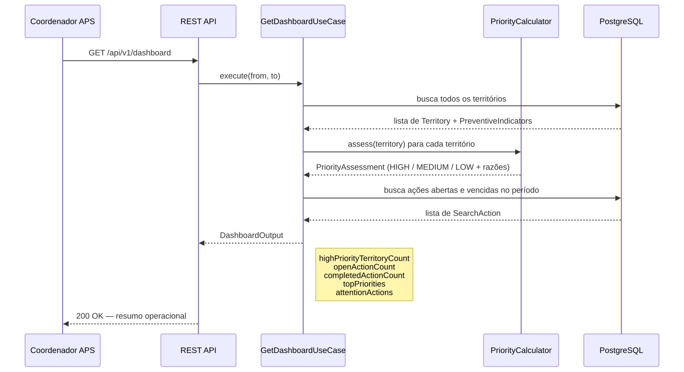
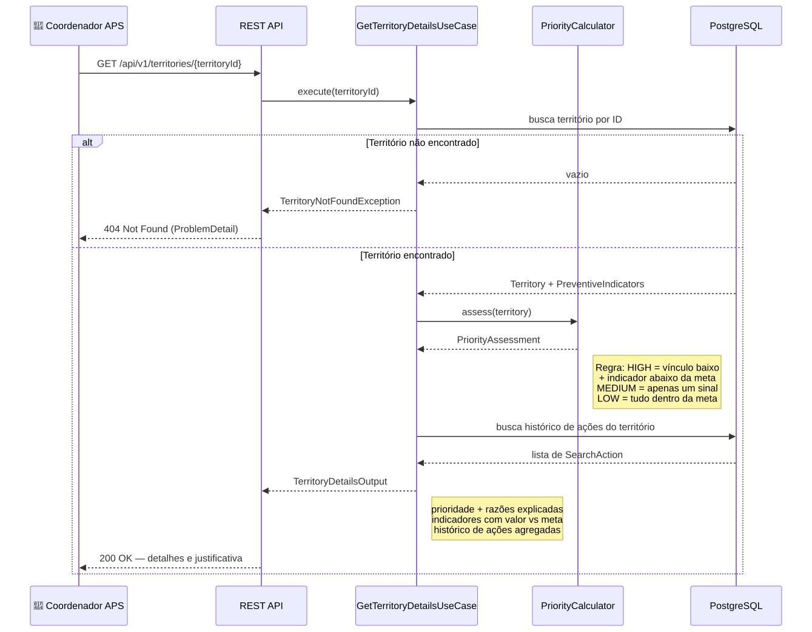
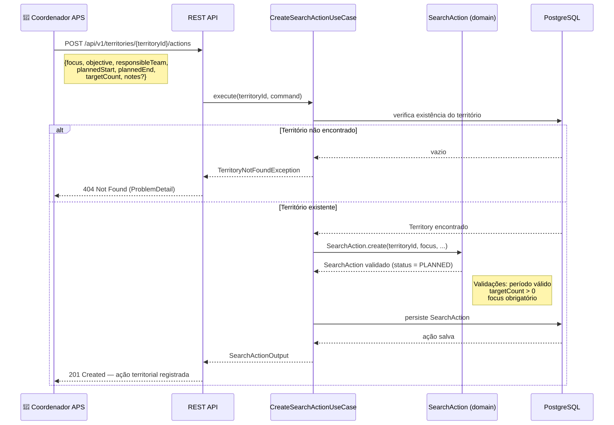
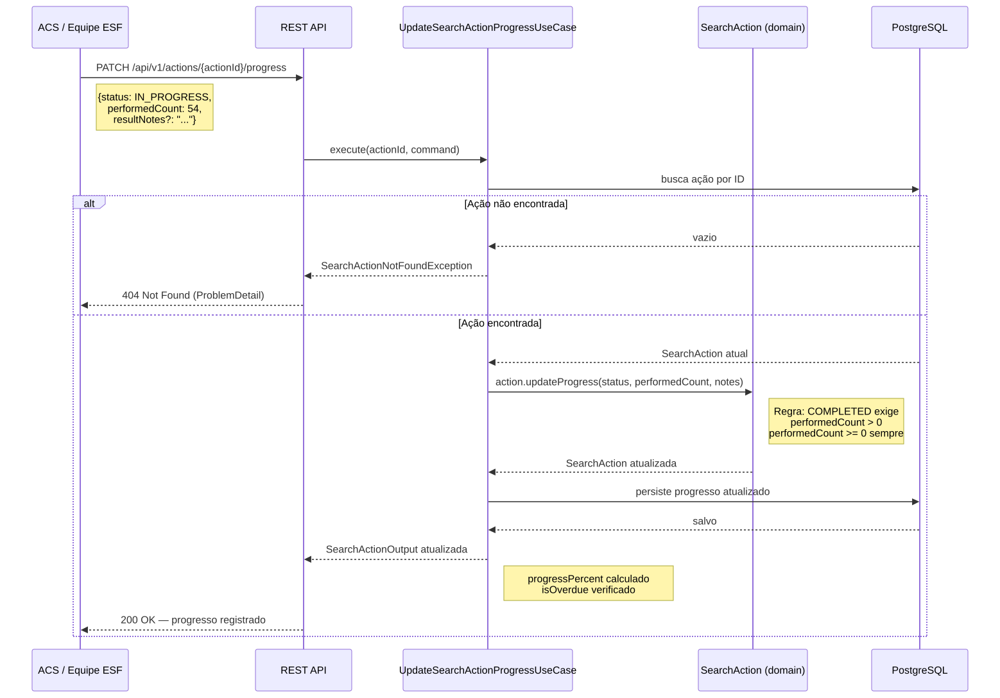

# Relatório de Projeto: Gestão Ativa na APS (SUS-Connect)
## Hackathon Pós-Tech FIAP - Software Architecture (Fase 05)

### Equipe
| Nome | RM |
| --- | --- |
| Emerson Pereira da Silva | RM367268 |
| Luiz Octavio Tassinari Saraiva | RM367408 |

---

## Resumo Executivo
O **SUS-Connect APS** é um MVP focado na priorização territorial e no planejamento operacional de busca ativa preventiva na Atenção Primária à Saúde (APS). Projetado para apoiar coordenadores municipais e de Unidades Básicas de Saúde (UBS), o sistema responde de maneira clara e explicável à seguinte pergunta: **"Qual território ou UBS deve receber uma ação preventiva primeiro, e por qual motivo?"** O sistema opera exclusivamente com indicadores de saúde consolidados e territorializados de forma agregada, sem coletar, armazenar ou processar quaisquer dados pessoais, prontuários ou riscos clínicos individuais de pacientes. A prioridade gerada é um sinal operacional explicável que orienta o planejamento das equipes de saúde da família em suas visitas de campo, fechando um ciclo operacional ponta a ponta que pode ser demonstrado em menos de 8 minutos.

---

## 1. Introdução e Contexto
O desafio do Hackathon da Fase 05 propõe a concepção e implementação de uma solução prática e inovadora para otimizar o atendimento no Sistema Único de Saúde (SUS), melhorando a experiência de pacientes, gestores e profissionais de saúde. 

A Atenção Primária à Saúde (APS) é a principal porta de entrada do SUS e desempenha um papel crucial na prevenção de agravos à saúde e na redução de internações desnecessárias na média e alta complexidade. Contudo, a coordenação municipal de saúde frequentemente enfrenta grandes dificuldades para gerenciar equipes de Estratégia de Saúde da Família (ESF) de forma preditiva e eficiente, em virtude da fragmentação dos dados municipais de saúde e da falta de ferramentas simples que traduzam dados de indicadores preventivos em roteiros de trabalho práticos.

O **SUS-Connect APS** preenche essa lacuna ao transformar indicadores analíticos populacionais (vínculo com a APS, vacinação infantil, acompanhamento de gestantes e controle de condições crônicas como hipertensão e diabetes) em uma fila operacional ordenada por prioridade de intervenção territorial.

---

## 2. Problema Identificado e Justificativa
A gestão municipal de saúde carece de ferramentas que facilitem a tomada de decisão rápida e territorializada. Os coordenadores de APS e gerentes de UBS deparam-se com os seguintes cenários limitantes:
* **Dispersão de Indicadores**: Dados de cobertura vacinal, pré-natal e condições crônicas encontram-se espalhados em sistemas distintos ou planilhas estáticas de difícil consolidação, exigindo análises manuais demoradas antes que se decida onde atuar.
* **Falta de Foco Territorial**: A busca ativa de pacientes muitas vezes ocorre de maneira reativa ou uniforme por todas as equipes, sem priorizar os bairros ou microáreas que apresentam os piores índices e o menor vínculo com a rede básica.
* **Ausência de Explicação de Prioridade**: Quando há priorização, as regras de classificação costumam ser opacas ou de difícil interpretação para as equipes de ponta, enfraquecendo o engajamento operacional.
* **Escassez de Recursos**: Com equipes e tempo limitados, é inviável dar o mesmo nível de atenção a todas as microáreas simultaneamente. É imperativo direcionar o esforço de busca ativa preventiva exatamente para onde a necessidade operacional é mais aguda.

**Justificativa de Escopo**: O MVP adota como unidade básica de análise o **território (ou UBS)**, e nunca o paciente individual. Esta decisão de design simplifica os requisitos de segurança de dados (atendendo integralmente à LGPD), elimina barreiras éticas e burocráticas para a implantação inicial, e foca o software estritamente na melhoria de processos operacionais e planejamento de ações comunitárias integradas.

---

## 3. Processo de Desenvolvimento e Design Thinking
O desenvolvimento do SUS-Connect APS seguiu um ciclo rigoroso de Design Thinking e priorização de problemas:

### 3.1. Brainstorming e Matriz de Problemas Candidatos
A equipe avaliou diferentes frentes do SUS a partir das bases oficiais de dados (SISAB, CNES, IBGE). Construiu-se uma matriz de priorização de problemas comparando alternativas, como a gestão de leitos de média complexidade contra a busca ativa na APS. A Atenção Primária à Saúde foi selecionada porque a análise indicou que as disparidades de cobertura territorial nos municípios representam uma oportunidade gigantesca de evitar complicações de saúde evitáveis por meio de ações preventivas direcionadas de curto prazo.

### 3.2. Personas do Sistema
Para orientar as funcionalidades e a usabilidade do MVP, mapeamos as seguintes personas:
* **Persona Principal (Coordenação de APS / Gerência de UBS)**: Responsável por gerenciar os recursos, acompanhar o desempenho dos indicadores e definir as metas e o cronograma de busca ativa para as equipes de Saúde da Família. Necessita de visibilidade consolidada e tomada de decisão ágil.
* **Persona Secundária (Equipes de Saúde da Família - ESF / Agentes Comunitários de Saúde - ACS)**: Atuam diretamente no território. Consultam a ação territorial preventiva criada pela coordenação, executam as visitas de busca ativa a campo e registram o progresso de maneira agregada e simplificada.

### 3.3. Jornada do Usuário
1. **Identificação**: O coordenador acessa o painel do SUS-Connect e visualiza que o território de "Jardim Esperança" está classificado como *Alta Prioridade*.
2. **Diagnóstico Operacional**: O usuário clica no território e vê a explicação: a taxa de vínculo com a rede está em 42% (abaixo da meta de 50%) e o indicador de Condições Crônicas (hipertensão/diabetes) está severamente abaixo da meta de referência.
3. **Ação**: O coordenador cria uma ação territorial de busca ativa preventiva com foco em Condições Crônicas, definindo a equipe responsável, prazo e uma meta agregada de 80 visitas operacionais.
4. **Execução**: A equipe de campo realiza os contatos no território e atualiza o sistema periodicamente apenas com a quantidade total de visitas efetuadas (ex: 54 visitas realizadas).
5. **Acompanhamento**: O coordenador monitora o progresso operacional agregado no painel em tempo real, verificando se o esforço foi cumprido de forma rastreável.

---

## 4. Requisitos Atendidos

### 4.1. Requisitos Funcionais (RF)
| ID | Requisito | Status | Implementação |
| --- | --- | --- | --- |
| **RF01** | Painel de resumo operacional (Dashboard) | **Implementado** | Endpoint `/api/v1/dashboard` compila estatísticas de prioridades territoriais e andamento de ações de busca ativa. |
| **RF02** | Listagem de territórios ordenada por nível de prioridade | **Implementado** | Endpoint `/api/v1/territories` lista e ordena territórios por nível crítico. |
| **RF03** | Filtragem de territórios por prioridade e foco preventivo | **Implementado** | Parâmetros de consulta `priority` e `focus` mapeados no endpoint `/api/v1/territories`. |
| **RF04** | Exibição de explicação detalhada da prioridade do território | **Implementado** | Endpoint `/api/v1/territories/{territoryId}` detalha regras vigentes e desvios de indicadores. |
| **RF05** | Criação de ação territorial de busca ativa | **Implementado** | Endpoint `/api/v1/territories/{territoryId}/actions` registra nova ação parametrizada. |
| **RF06** | Atualização de situação, progresso e observações da ação | **Implementado** | Endpoint `/api/v1/actions/{actionId}/progress` atualiza progresso de visitas realizadas. |
| **RF07** | Exibição de progresso comparado com a meta planejada | **Implementado** | Cálculo de progresso percentual incorporado no retorno do dashboard e detalhes do território. |
| **RF08** | Destaque de ações vencidas ou próximas do término | **Implementado** | O dashboard inicial analisa os cronogramas das ações em aberto e agrupa os itens que requerem atenção operacional. |
| **RF09** | Carga de base demonstrativa de indicadores de território | **Implementado** | Endpoints administrativos `POST /territories` e `PUT /territories/{territoryId}/indicators` permitem carregar ou substituir dados territoriais para testes robustos. |

### 4.2. Requisitos Não Funcionais (RNF)
| ID | Requisito | Implementação |
| --- | --- | --- |
| **RNF01** | Independência de fontes externas em tempo real | O MVP inclui um conjunto completo de dados e indicadores territorializados mockados para demonstração imediata do fluxo de ponta a ponta. |
| **RNF02** | Interface acessível e priorização baseada em texto explicativo | As prioridades são representadas e explicadas textualmente por regras explícitas de negócio e rótulos explícitos (*Alta*, *Média*, *Baixa*). |
| **RNF03** | Registro de competência temporal dos indicadores territoriais | Cada carga de indicadores possui a data de competência/vigência registrada no banco de dados persistente. |
| **RNF04** | Ausência absoluta de dados pessoais e clínicos individuais | O sistema opera estritamente no nível geográfico e populacional agregado, impedindo o cadastro ou vazamento de dados de cidadãos. |
| **RNF05** | Alinhamento com a finalidade de apoio operacional à decisão | Toda a documentação e respostas de sistema reforçam que os dados atuam como hipóteses operacionais, cabendo a validação clínica às equipes de saúde. |
| **RNF06** | Demonstração ágil em menos de 8 minutos | Coleções completas do Bruno e do Insomnia foram estruturadas para execução em 7 etapas rápidas. |

---

## 5. Arquitetura do Sistema e Modelo de Implantação
O SUS-Connect APS é estruturado como um microsserviço monolítico persistente moderno, adotando os princípios de **Clean Architecture** para assegurar alta manutenibilidade, testabilidade isolada e independência de frameworks.

O sistema é construído sobre as seguintes especificações técnicas:
* **Linguagem**: Java 21 LTS
* **Framework**: Spring Boot 3.4.5
* **Banco de Dados**: PostgreSQL 16 (porta local: 5434)
* **Gerenciador de Dependências**: Maven 3.9+
* **Controle de Versão de Esquema**: Flyway migrations
* **Containerização**: Docker e Docker Compose para execução e isolamento completos do ambiente

### 5.1. Camadas da Clean Architecture
A estrutura do módulo `aps-prioritization-service` separa rigorosamente as preocupações de domínio e infraestrutura:
1. **Core Domain (`core/domain`)**: Escrito em Java puro, sem nenhuma dependência de bibliotecas externas ou frameworks (como Spring ou JPA). Contém as entidades ricas de negócio (`Territory`, `PreventiveIndicator`, `SearchAction`) e as regras fundamentais — incluindo `PriorityCalculator`, que implementa a lógica determinística de classificação de prioridade, e os enums `PriorityLevel`, `PreventiveFocus` e `ActionStatus`.
2. **Core Use Case (`core/usecase`)**: Contém os casos de uso que orquestram a lógica da aplicação (`GetDashboardUseCase`, `ListTerritoriesUseCase`, `GetTerritoryDetailsUseCase`, `CreateTerritoryUseCase`, `ReplaceTerritoryIndicatorsUseCase`, `CreateSearchActionUseCase`, `UpdateSearchActionProgressUseCase`), acionando os adaptadores através de gateways de interface.
3. **Core Gateways e DTOs (`core/gateway` e `core/dto`)**: Define os contratos de repositório para persistência de dados e as classes imutáveis do tipo `record` para transferência limpa de informações.
4. **Infrastructure Layer (`infra`)**: Camada mais externa que contém o Spring Boot, os controladores REST (`infra/web`), as entidades JPA (`infra/entity`) e repositórios Spring Data (`infra/repository`), os adaptadores de gateway (`infra/gateway`), configurações de beans (`infra/config`), tratamento global de erros HTTP por meio de `ProblemDetail`, e os scripts SQL gerenciados pelo Flyway.

### 5.2. Visão Geral da Arquitetura



### 5.3. Camadas Internas — Clean Architecture



### 5.4. Implantação — Docker Compose



### 5.5. Modelo de Domínio: Território e Prioridade



### 5.6. Modelo de Domínio: Ação de Busca Ativa



### 5.7. Modelagem Relacional



---

## 6. Fluxos Principais do MVP
A demonstração do sistema executa o fluxo operacional em um ciclo fechado de 4 etapas principais:

### 6.1. Painel Operacional (Dashboard)



### 6.2. Diagnóstico do Território



### 6.3. Criação de Ação de Busca Ativa



### 6.4. Atualização de Progresso pela Equipe de Campo



---

## 7. Funções e Módulos Criados
A estrutura de diretórios do repositório é organizada da seguinte maneira:
* `aps-prioritization-service/`: Projeto principal Java 21 / Spring Boot contendo toda a inteligência do MVP, testes automatizados e o esquema do PostgreSQL.
* `analytics/`: Projetos de ciência de dados agregados com scripts Python de auditoria e geração de relatórios analíticos que justificaram o escopo preventivo na APS.
* `data/`: Trilha de auditoria das bases brutos do SUS (`data/raw`) e saídas tratadas (`data/processed`).
* `docs/`: Documentações de produto, requisitos, diagramas de fluxo e recursos de apresentação.
* `scripts/`: Scripts automatizados para validação local e demonstração integradora de ponta a ponta.

---

## 8. API de Entrada e Contratos REST
Todos os endpoints utilizam o prefixo `/api/v1` e operam com payloads JSON estruturados.

### 8.1. Obter Resumo Operacional (Dashboard)
* **Método**: `GET`
* **Endpoint**: `/dashboard`
* **Parâmetros Opcionais**: `from=2026-07-01` (ISO date), `to=2026-07-31` (ISO date) — define o período de análise das ações; padrão é o mês corrente.
* **Resposta de Sucesso (200 OK)**:
```json
{
  "periodStart": "2026-07-01",
  "periodEnd": "2026-07-26",
  "highPriorityTerritoryCount": 1,
  "openActionCount": 1,
  "completedActionCount": 1,
  "topPriorities": [
    {
      "id": "10000000-0000-0000-0000-000000000001",
      "code": "T-001",
      "name": "Jardim Esperanca",
      "unitName": "UBS Jardim Esperanca",
      "linkedPopulationPercent": 42.00,
      "dataCompetence": "2026-06",
      "priority": "HIGH",
      "attentionFocus": "CHRONIC_CONDITIONS",
      "attentionFocusLabel": "Condicoes cronicas",
      "openActionCount": 1
    }
  ],
  "attentionActions": [
    {
      "actionId": "20000000-0000-0000-0000-000000000002",
      "territoryId": "10000000-0000-0000-0000-000000000002",
      "territoryName": "Vila Nova",
      "plannedEnd": "2026-07-10",
      "reason": "Overdue"
    }
  ]
}
```

### 8.2. Listar Territórios por Prioridade
* **Método**: `GET`
* **Endpoint**: `/territories`
* **Parâmetros Opcionais**: `priority=HIGH`, `focus=CHRONIC_CONDITIONS`
* **Resposta de Sucesso (200 OK)**:
```json
[
  {
    "id": "10000000-0000-0000-0000-000000000001",
    "code": "T-001",
    "name": "Jardim Esperanca",
    "unitName": "UBS Jardim Esperanca",
    "linkedPopulationPercent": 42.00,
    "dataCompetence": "2026-06",
    "priority": "HIGH",
    "attentionFocus": "CHRONIC_CONDITIONS",
    "attentionFocusLabel": "Condicoes cronicas",
    "openActionCount": 1
  }
]
```

### 8.3. Explicar Prioridade do Território
* **Método**: `GET`
* **Endpoint**: `/territories/{territoryId}`
* **Resposta de Sucesso (200 OK)**:
```json
{
  "id": "10000000-0000-0000-0000-000000000001",
  "code": "T-001",
  "name": "Jardim Esperanca",
  "unitName": "UBS Jardim Esperanca",
  "linkedPopulationPercent": 42.00,
  "dataCompetence": "2026-06",
  "priority": {
    "level": "HIGH",
    "linkageTarget": 50.00,
    "reasons": [
      "Linked population 42.00% is below the configured target of 50.00%",
      "Condicoes cronicas is 32.00% against target 60.00%"
    ]
  },
  "indicators": [
    {
      "focus": "CHRONIC_CONDITIONS",
      "label": "Condicoes cronicas",
      "score": 32.00,
      "target": 60.00,
      "belowTarget": true
    },
    {
      "focus": "PRENATAL_CARE",
      "label": "Acompanhamento prenatal",
      "score": 72.00,
      "target": 85.00,
      "belowTarget": true
    }
  ],
  "actions": [
    {
      "id": "20000000-0000-0000-0000-000000000001",
      "territoryId": "10000000-0000-0000-0000-000000000001",
      "focus": "CHRONIC_CONDITIONS",
      "focusLabel": "Condicoes cronicas",
      "objective": "Reconnect people with chronic conditions to preventive follow-up",
      "responsibleTeam": "ESF Jardim Esperanca",
      "plannedStart": "2026-07-23",
      "plannedEnd": "2026-07-30",
      "targetCount": 80,
      "performedCount": 54,
      "progressPercent": 67.50,
      "status": "IN_PROGRESS",
      "notes": null,
      "resultNotes": "54 contatos agregados registrados pela equipe no territorio.",
      "createdAt": "2026-07-23T10:00:00",
      "updatedAt": "2026-07-25T14:30:00"
    }
  ]
}
```

### 8.4. Criar Ação Preventiva de Busca Ativa
* **Método**: `POST`
* **Endpoint**: `/territories/{territoryId}/actions`
* **Payload de Entrada**:
```json
{
  "focus": "CHRONIC_CONDITIONS",
  "objective": "Organizar busca ativa territorial para acompanhamento preventivo de condicoes cronicas",
  "responsibleTeam": "ESF Jardim Esperanca",
  "plannedStart": "2026-07-23",
  "plannedEnd": "2026-07-30",
  "targetCount": 80,
  "notes": "Massa demonstrativa com contagens agregadas. Nao ha dados de pacientes."
}
```
* **Resposta de Sucesso (201 Created)**: retorna o objeto completo da ação criada (`SearchActionOutput`).
```json
{
  "id": "20000000-0000-0000-0000-000000000004",
  "territoryId": "10000000-0000-0000-0000-000000000001",
  "focus": "CHRONIC_CONDITIONS",
  "focusLabel": "Condicoes cronicas",
  "objective": "Organizar busca ativa territorial para acompanhamento preventivo de condicoes cronicas",
  "responsibleTeam": "ESF Jardim Esperanca",
  "plannedStart": "2026-07-23",
  "plannedEnd": "2026-07-30",
  "targetCount": 80,
  "performedCount": 0,
  "progressPercent": 0.00,
  "status": "PLANNED",
  "notes": "Massa demonstrativa com contagens agregadas. Nao ha dados de pacientes.",
  "resultNotes": null,
  "createdAt": "2026-07-26T09:00:00",
  "updatedAt": "2026-07-26T09:00:00"
}
```

### 8.5. Atualizar Progresso Operacional da Ação
* **Método**: `PATCH`
* **Endpoint**: `/actions/{actionId}/progress`
* **Payload de Entrada**:
```json
{
  "status": "IN_PROGRESS",
  "performedCount": 54,
  "resultNotes": "54 contatos agregados registrados pela equipe no territorio."
}
```
* **Resposta de Sucesso (200 OK)**: retorna o objeto completo da ação atualizada (`SearchActionOutput`).
```json
{
  "id": "20000000-0000-0000-0000-000000000004",
  "territoryId": "10000000-0000-0000-0000-000000000001",
  "focus": "CHRONIC_CONDITIONS",
  "focusLabel": "Condicoes cronicas",
  "objective": "Organizar busca ativa territorial para acompanhamento preventivo de condicoes cronicas",
  "responsibleTeam": "ESF Jardim Esperanca",
  "plannedStart": "2026-07-23",
  "plannedEnd": "2026-07-30",
  "targetCount": 80,
  "performedCount": 54,
  "progressPercent": 67.50,
  "status": "IN_PROGRESS",
  "notes": "Massa demonstrativa com contagens agregadas. Nao ha dados de pacientes.",
  "resultNotes": "54 contatos agregados registrados pela equipe no territorio.",
  "createdAt": "2026-07-26T09:00:00",
  "updatedAt": "2026-07-26T12:00:00"
}
```

---

## 9. Regras de Negócio e Lógicas de Priorização

### RN01 - Unidade de Priorização Exclusivamente Territorial
A unidade mínima de classificação e acompanhamento do SUS-Connect é a área territorial de abrangência ou a Unidade Básica de Saúde (UBS). É expressamente vedado o processamento de registros clínicos individuais, cadastros de prontuários ou identificadores de pacientes singulares no escopo do MVP.

### RN02 - Explicabilidade da Prioridade
A prioridade gerada para cada território de saúde deve ser acompanhada de uma justificativa textual clara, dedutível de forma determinística por regras de comparação matemática simples entre os indicadores populacionais vigentes e as metas operacionais configuradas pelo município.

### RN03 - Lógica de Classificação Inicial de Prioridade
O cálculo da prioridade apoia-se em dois eixos operacionais chaves:
1. **Taxa de Vínculo com a APS**: Representa o percentual de residentes do território efetivamente cadastrados e acompanhados ativamente pela rede básica de saúde. A meta populacional inicial padrão é de **50%** (parametrizável por `APS_LINKAGE_TARGET`).
2. **Desempenho dos Indicadores Preventivos**: Análise de metas para quatro frentes de prevenção:
   * Acompanhamento de Condições Crônicas (Hipertensão/Diabetes);
   * Cobertura de Vacinação Infantil;
   * Acompanhamento de Pré-natal (Gestantes);
   * Exames Citopatológicos periódicos.

A prioridade operacional é calculada conforme a seguinte regra determinística:
* **ALTA (HIGH)**: Taxa de vínculo territorial com a APS está abaixo da meta configurada **E** pelo menos um indicador preventivo local está abaixo da sua meta de referência.
* **MÉDIA (MEDIUM)**: Apenas um dos dois fatores (vínculo ou algum indicador preventivo) está abaixo da sua meta de referência correspondente.
* **BAIXA (LOW)**: Ambos os fatores atendem ou superam as metas operacionais vigentes.

### RN04 - Vinculação Obrigatória de Ações de Busca Ativa
Qualquer ação de busca ativa criada pelo coordenador no sistema deve ser associada obrigatoriamente a um território existente e a um foco de prevenção correspondente aos indicadores da plataforma.

### RN05 - Registro Agregado de Progresso
A evolução operacional de uma ação de busca ativa é contabilizada exclusivamente de maneira cumulativa por meio de contagens de visitas planejadas versus efetuadas, sem detalhamento individual dos pacientes abordados pelas equipes.

### RN06 - Condição de Encerramento de Ação
Uma ação só pode ser marcada como concluída se possuir um registro de contatos realizados válido (maior ou igual a zero), impedindo o encerramento prematuro sem o preenchimento de dados de conclusão.

---

## 10. Persistência de Dados e Banco de Dados (PostgreSQL)
A persistência do MVP utiliza PostgreSQL estruturado, com atualizações e criação de esquema gerenciadas por scripts de migração do Flyway.

### 10.1. Modelagem Relacional

```
  +--------------------+             +---------------------------+
  |    territories     | 1         * |   territory_indicators    |
  |--------------------|-------------|---------------------------|
  | id (UUID) PK       |             | id (UUID) PK              |
  | code (VARCHAR) UQ  |             | territory_id FK           |
  | name               |             | focus (VARCHAR)           |
  | unit_name          |             | score NUMERIC(5,2)        |
  | linked_population_ |             | target NUMERIC(5,2)       |
  |   _percent         |             +---------------------------+
  | data_competence    |
  | created_at         |
  +--------------------+
           | 1
           |
           | *
  +--------------------------------+
  |        search_actions          |
  |--------------------------------|
  | id (UUID) PK                   |
  | territory_id FK                |
  | focus (VARCHAR)                |
  | objective                      |
  | responsible_team               |
  | planned_start, planned_end     |
  | target_count, performed_count  |
  | status, notes, result_notes    |
  | created_at, updated_at         |
  +--------------------------------+
```

O esquema físico é provisionado pela migração Flyway `V1__create_aps_prioritization_schema.sql`. A **massa de dados demonstrativos é carregada via `DemoDataConfig`** (bean Spring condicional à propriedade `aps.demo-data.enabled=true`), não por script SQL, o que permite desativá-la em ambientes de produção sem alterar as migrações.

---

## 11. Segurança, Governança e Limitações de Dados

### 11.1. Governança e LGPD
A arquitetura do SUS-Connect APS resolve o desafio da segurança de dados de saúde eliminando-os por completo da sua área operacional de software. Por não processar nomes de pacientes, CPFs, exames clínicos detalhados ou prontuários, o MVP:
* Não cria vulnerabilidades de vazamento de dados pessoais altamente sensíveis.
* Reduz custos drásticos de conformidade com a LGPD e auditoria de infraestrutura.
* Mantém o foco do software inteiramente no planejamento de gestão e rotina operacional das unidades.

### 11.2. Limitação de Interpretação e Apoio à Decisão
Os dados apresentados pelo sistema representam visões consolidadas de competências passadas (fornecidas pelas bases oficiais). Eles auxiliam a coordenação a traçar hipóteses de planejamento territorial ("Este bairro necessita de foco em diabetes"), mas nunca determinam uma certeza clínica definitiva ou substituem a avaliação assistencial presencial efetuada pelos médicos, enfermeiros e agentes comunitários de saúde.

---

## 12. Monitoramento e Observabilidade
O microsserviço conta com o **Spring Boot Actuator** ativo, disponibilizando o endpoint padrão `/actuator/health` para verificações de saúde e integridade em tempo real (incluindo conectividade com o PostgreSQL). No contêiner, todas as saídas de logs são direcionadas para o console padrão, viabilizando o monitoramento operacional através do Docker Compose ou agregadores de telemetria locais.

---

## 13. Deploy e Integração Contínua (CI/CD)
O pipeline de integração e entrega contínua do repositório é gerenciado através do GitHub Actions no workflow `.github/workflows/ci.yml`.

A cada atualização enviada para a branch `codex-oportunidades-sus-analise`, as seguintes validações são executadas sequencialmente:
1. **Compilação e Testes Unitários**: Executa `mvn clean test` para garantir a validação de todas as regras de domínio e fluxos de serviço.
2. **Validação de Formatação**: O plugin Spotless valida se as diretrizes de codificação de Clean Code estão sendo rigorosamente respeitadas.
3. **Cobertura de Código JaCoCo**: O pipeline de qualidade do Maven impõe uma cobertura de teste automatizada mínima de **90%** em todos os pacotes e classes de produção (`jacoco:check@coverage-check`). Qualquer commit que cause uma queda na cobertura de testes provocará a falha do build, impedindo a integração de códigos sem testes robustos.

---

## 14. Execução Local e Validação

### 14.1. Pré-requisitos
* Java 21 instalado e configurado na máquina local.
* Maven 3.9+ instalado.
* Docker Desktop ativo.

### 14.2. Execução Rápida do Ambiente
Para iniciar o banco de dados PostgreSQL e a API Spring Boot pré-configurada e alimentada com os dados demonstrativos, execute:
```bash
# Subir os contêineres e construir a API
docker compose up -d --build aps-prioritization-service

# Verificar o estado dos contêineres
docker compose ps
```

### 14.3. Testes Automatizados e de Integração
Para executar o conjunto completo de testes e validar a cobertura mínima de 90% via linha de comando local:
```bash
# Executar testes unitários e de integração HTTP
mvn -q -pl aps-prioritization-service -am test

# Validar barreira de cobertura de 90% do JaCoCo
mvn -q -pl aps-prioritization-service jacoco:check@coverage-check
```

No Windows, o fluxo integrado completo com contêineres isolados dedicados a testes pode ser executado através do script automatizado PowerShell:
```powershell
powershell -ExecutionPolicy Bypass -File .\scripts\run-e2e.ps1
```

### 14.4. Validação dos Endpoints via Bruno ou Insomnia
O projeto disponibiliza coleções completas pré-configuradas para validação visual rápida do fluxo de ponta a ponta:
* **Bruno Collection**: Pasta local `docs/tecnico/api/Aps-Prioritization`. O Bruno permite executar o roteiro operacional completo de 7 passos capturando de forma dinâmica o ID da ação de busca ativa gerada no Passo 5 para atualizar seu progresso de contatos no Passo 6.
* **Insomnia Collection**: Arquivo JSON disponível em `docs/tecnico/api/aps-prioritization-insomnia.json`.

---

## 15. Aprendizados e Próximos Passos

### 15.1. Principais Aprendizados
* **Escopo e Foco**: A escolha cirúrgica do problema operacional focado em priorização territorial, em vez de tentar resolver toda a complexidade clínica do SUS de uma só vez, permitiu que a equipe construísse um software prático, demonstrável e de altíssimo valor de gestão em tempo recorde.
* **Clean Architecture na Prática**: Isolar a lógica de domínio de frameworks externos permitiu criar testes unitários rápidos e garantiu que o coração da aplicação permanecesse livre de acoplamentos tecnológicos que complicariam migrações ou refatorações futuras.
* **Segurança por Desenho**: O uso estrito de dados agregados e de foco geográfico provou que é perfeitamente viável construir produtos de inteligência de saúde eficientes sem elevar o risco de privacidade para os cidadãos.

### 15.2. Próximos Passos
1. **Módulo de Geolocalização de Visitas**: Integração com dados cartográficos agregados de setores censitários (IBGE) para plotar mapas de calor com as UBSs e territórios mais críticos em alta prioridade.
2. **Integração Batch e Sincronização e-SUS**: Criação de rotinas seguras e pontuais para importação em lotes de dados do SISAB (Sistema de Informação em Saúde para a Atenção Básica) e e-SUS APS para atualizar as metas de indicadores com dados municipais reais de forma periódica.
3. **Planejador Offline de Visitas para ACS**: Uma extensão mobile ou de interface simplificada que permita ao Agente Comunitário de Saúde baixar o plano operacional territorial criado e preencher suas visitas mesmo sem acesso constante à internet nas áreas rurais e periféricas.

---

## 16. Links Úteis do Projeto
* **Repositório do Código (Branch de Desenvolvimento)**: [GitHub - eps364/tech-challenge-fase-05](https://github.com/eps364/tech-challenge-fase-05)
* **Video Pitch**: [https://www.youtube.com/watch?v=J10DTc7Rg7U](https://www.youtube.com/watch?v=J10DTc7Rg7U)


---

## 17. Glossário de Siglas

### Saúde e Governo

| Sigla | Descrição |
| --- | --- |
| **ACS** | Agente Comunitário de Saúde |
| **APS** | Atenção Primária à Saúde |
| **BNAFAR** | Banco Nacional de Dados de Ações e Serviços da Assistência Farmacêutica |
| **CNES** | Cadastro Nacional de Estabelecimentos de Saúde |
| **CPF** | Cadastro de Pessoas Físicas |
| **ESF** | Estratégia de Saúde da Família |
| **IBGE** | Instituto Brasileiro de Geografia e Estatística |
| **LGPD** | Lei Geral de Proteção de Dados Pessoais |
| **SIA/SUS** | Sistema de Informações Ambulatoriais do SUS |
| **SIH/SUS** | Sistema de Informações Hospitalares do SUS |
| **SISAB** | Sistema de Informação em Saúde para a Atenção Básica |
| **SUS** | Sistema Único de Saúde |
| **UBS** | Unidade Básica de Saúde |
| **UTI** | Unidade de Terapia Intensiva |
| **e-SUS** | Estratégia nacional de informatização da saúde (plataforma digital do Ministério da Saúde) |

### Projeto e Acadêmico

| Sigla | Descrição |
| --- | --- |
| **FIAP** | Faculdade de Informática e Administração Paulista |
| **MVP** | Minimum Viable Product — Produto Mínimo Viável |
| **RF** | Requisito Funcional |
| **RM** | Registro de Matrícula |
| **RN** | Regra de Negócio |
| **RNF** | Requisito Não Funcional |

### Tecnologia

| Sigla | Descrição |
| --- | --- |
| **API** | Application Programming Interface — Interface de Programação de Aplicações |
| **CI/CD** | Continuous Integration / Continuous Delivery — Integração Contínua / Entrega Contínua |
| **DTO** | Data Transfer Object — Objeto de Transferência de Dados |
| **FK** | Foreign Key — Chave Estrangeira |
| **HTTP** | Hypertext Transfer Protocol |
| **JaCoCo** | Java Code Coverage — biblioteca de cobertura de código para Java |
| **JPA** | Jakarta Persistence API — especificação de persistência de dados em Java |
| **JSON** | JavaScript Object Notation — formato leve de troca de dados |
| **LTS** | Long-Term Support — versão com suporte de longo prazo |
| **PK** | Primary Key — Chave Primária |
| **REST** | Representational State Transfer — estilo arquitetural para APIs web |
| **SQL** | Structured Query Language — linguagem de consulta estruturada para bancos de dados relacionais |
| **UUID** | Universally Unique Identifier — identificador único universal |
