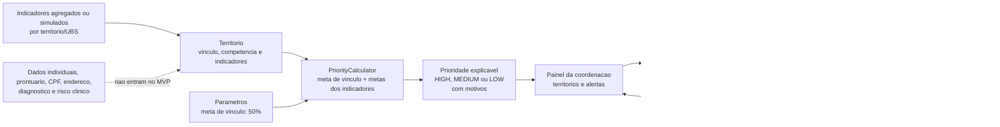

# Storytelling de demonstracao - gestao ativa na APS

Data da evidencia: 2026-07-19. Os horarios dos logs Docker estao em UTC.

## A situacao que queremos melhorar

Uma coordenadora de APS precisa decidir onde concentrar a proxima acao de busca
ativa. Ela tem pouco tempo, equipes limitadas e indicadores territoriais
dispersos. Sem uma prioridade explicita, a decisao depende de planilhas e de
percepcao individual, o que torna mais dificil agir antes que lacunas de
acompanhamento preventivo se acumulem.

Joao e um personagem ficticio que ajuda a tornar o problema concreto. Anos
atras, ele iniciou acompanhamento para hipertensao e diabetes, mas deixou de
retornar regularmente. Quando procura uma UPA com um quadro agravado, o sistema
nao tenta explicar ou tratar o caso dele. A oportunidade anterior a urgencia e
organizacional: identificar um territorio em que muitas pessoas podem ter se
desconectado do acompanhamento preventivo e organizar um retorno ativo.

O MVP nao armazena Joao, seu prontuario, CPF, endereco, diagnostico ou risco
individual. Ele apoia a coordenacao a enxergar um sinal territorial agregado e
acompanhar a execucao da resposta da equipe.

## A historia no sistema em execucao

1. A coordenadora abre o painel. Na massa demonstrativa atual, ele mostra um
   territorio em prioridade alta, duas acoes abertas e uma acao concluida no
   periodo de 2026-07-01 a 2026-07-19.
2. O primeiro territorio e Jardim Esperanca, da UBS Jardim Esperanca. O vinculo
   territorial e 42%, abaixo da meta configurada de 50%.
3. O detalhe explica o segundo sinal: condicoes cronicas esta em 32% para uma
   meta de 60%. O acompanhamento prenatal tambem esta abaixo da meta, em 72%
   para uma meta de 85%.
4. A combinacao de vinculo abaixo da meta e de indicador preventivo abaixo da
   meta resulta em prioridade `HIGH`. Isso e uma regra operacional explicavel,
   nao diagnostico, previsao clinica ou prova de que uma acao evitara uma
   internacao.
5. A coordenadora cria ou acompanha uma acao territorial de reconexao ao
   acompanhamento de condicoes cronicas. A massa demonstrativa possui meta de
   80 contatos, 54 contatos agregados realizados e status `IN_PROGRESS`.
6. O progresso exibido e 67,50%. O registro de resultado informa 31 pessoas
   reconectadas ao acompanhamento, tambem de forma agregada. Esse numero mede a
   execucao da acao; ele nao comprova impacto clinico nem causalidade.
7. O painel fecha o ciclo operacional: mostra uma acao vencida em Vila Nova e
   uma acao proxima do termino em Jardim Esperanca, permitindo que a
   coordenacao ajuste o trabalho das equipes.

## Como a informacao e tratada



O banco mantem somente tres grupos de dados: `territories`,
`territory_indicators` e `search_actions`. A prioridade nao e persistida; ela e
recalculada a cada consulta para refletir as metas configuradas e os indicadores
mais recentes.

## Evidencias tecnicas e fluxo observavel

Ambiente iniciado com:

```bash
docker compose up -d --build aps-prioritization-service
```

Testes e cobertura executados com:

```bash
docker run --rm -v "<workspace>:/workspace" -w /workspace \
  maven:3.9-eclipse-temurin-21 \
  mvn -q -pl aps-prioritization-service test jacoco:report \
  jacoco:check@coverage-check -DskipTests=false
```

Resultado observado: processo finalizado com codigo `0` e cobertura de linhas
de `98,94%`.

Consultas reais feitas contra `http://localhost:8205`:

```text
GET /actuator/health
{"status":"UP"}

GET /api/v1/dashboard
highPriorityTerritoryCount=1
openActionCount=2
completedActionCount=1

GET /api/v1/territories/10000000-0000-0000-0000-000000000001
priority=HIGH
linkedPopulationPercent=42.00
linkageTarget=50.00
focus=CHRONIC_CONDITIONS, score=32.00, target=60.00
actionStatus=IN_PROGRESS, performedCount=54, targetCount=80
```

Trechos relevantes dos logs do container APS:

```text
2026-07-19T00:08:08.215Z  INFO  Database: jdbc:postgresql://aps-prioritization-postgres:5432/aps_priority_db (PostgreSQL 15.18)
2026-07-19T00:08:08.263Z  INFO  Successfully validated 1 migration
2026-07-19T00:08:08.295Z  INFO  Schema "public" is up to date. No migration necessary.
2026-07-19T00:08:10.308Z  INFO  Tomcat started on port 8205 (http)
2026-07-19T00:08:10.319Z  INFO  Started ApsPrioritizationServiceApplication in 4.723 seconds
```

Esses logs comprovam que a infraestrutura iniciou, mas nao demonstram um fluxo
de negocio. A evidencia de ponta a ponta fica em
`docs/e2e/relatorio_execucao_e2e.md`, gerado pelo executor HTTP real. Ele
registra cada payload recebido, o caso de uso/regra aplicado e a resposta da
API persistida no PostgreSQL dedicado.

## Mensagem final da demonstracao

O produto nao promete que uma busca ativa elimina urgencias ou melhora um
indicador por si so. Ele torna visivel uma hipotese operacional: quando um
territorio mostra baixo vinculo e acompanhamento preventivo aquem da meta, a
coordenacao pode priorizar uma acao territorial, acompanhar sua execucao com
dados agregados e aprender com o ciclo seguinte.
